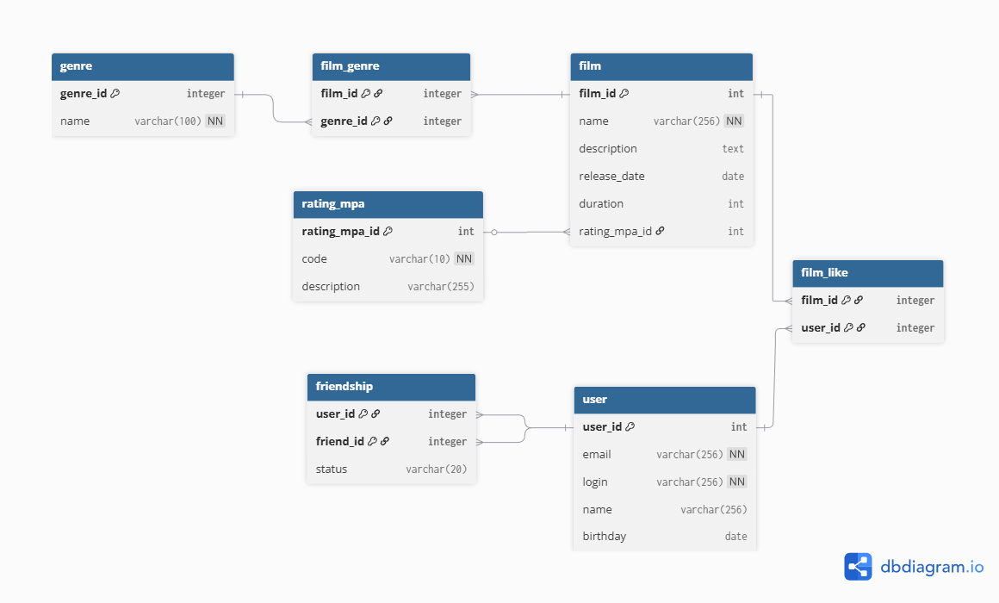

# java-filmorate
Template repository for Filmorate project.
# Filmorate - схема базы данных

## ER-диаграмма

## Описание схемы

База данных предназначена для хранения информации о фильмах(включает в себя его жанр и его рейтинг), пользователях, лайках и дружеских связях.

### Основные таблицы:

| Таблица | Назначение                                                                              |
|---------|-----------------------------------------------------------------------------------------|
| `user` | Данные пользователей                                                                    |
| `film` | Данные фильмов                                                                          |
| `genre` | Жанры                                                                                   |
| `rating_mpa` | Рейтинг MPA (G, PG, PG-13, R, NC-17)                                                    |
| `film_genre` | Связь «многие ко многим» между фильмами и жанрами                                       |
| `film_like` | Связь «многие ко многим» между фильмами и пользователями (лайки)                        |
| `friendship` | Дружеские связи между пользователями с учётом статуса |

---